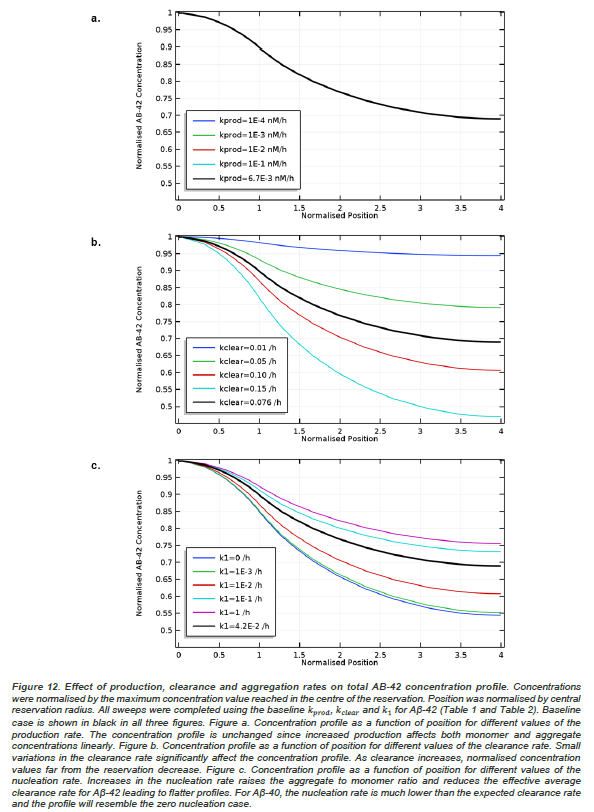

# Modelling Aβ production, aggregation and clearance in the brain and inside a microfluidic device

## Abstract
Alzheimer’s disease (AD) is the 6th deadliest disease in the United States (US). Increased aggregation of the amyloid β-peptide (Aβ) into small oligomers in the brain interstitial fluid (ISF) is believed to be the underlying cause of the neurological disorder. Although AD has been identified for more than a century, only 6 drugs have been approved by the US Food and Drug Administration to alleviate symptoms, and none of them effectively treat the causes of the disease. Microfluidic devices reproducing the brain microenvironment could accelerate drug discovery and improve our understanding of AD. The main challenge in the design of such devices is their physiological relevance. Here we establish a simple mathematical model designed to describe Aβ production, aggregation and clearance in the ISF for normal and diseased patients. The model is then extended to the case of microengineered tissue replicating the blood-brain barrier. The Finke-Watzky 2 step mechanism of slow continuous nucleation was used to fit experimental Aβ aggregation kinetic data with 𝑅2 values ≥98.5%. Our computational results show that in the ISF small Aβ-42 oligomers form through nucleation at a rate 3 orders of magnitude higher than Aβ-40. Competition between aggregation and clearance mechanisms drive the aggregate to monomer ratio. For Aβ-40, clearance dominates aggregation and fewer than 0.30% of Aβ-40 aggregate. Contrastingly, Aβ-42 aggregation and clearance rates are similar and more than 60% of peptides aggregate. As a result, Aβ-42 constitutes over 97.5% of oligomers in the ISF despite Aβ-40 being the predominant peptide produced in monomeric form. We show that in familial AD increased Aβ-42 production rates lead to higher Aβ-42 aggregate concentrations without affecting the aggregation kinetics or the aggregate to monomer ratio. In sporadic AD, failure of the Aβ clearance mechanism affects aggregate levels in two ways: 1) by favouring monomer aggregation and 2) by reducing aggregate clearance. Such deregulation of the aggregation-clearance balance leads to a 56% increase in Aβ-42 aggregate levels. Extending the mathematical model to the case of a microfluidic device requires introducing a spatial dependency of production and clearance mechanisms. We show that the size of the device can be adjusted to obtain different Aβ concentration profiles. In addition, we present a novel method for the determination of Aβ clearance via the artificially grown microvascular network.

## Key figures obtained using COMSOL and Python
### Aβ levels in the ISF

### Aβ levels in the microfluidic device

## Provided computational files
[COMSOL file for simulation](AD_device_spheroid_Model_only.mph) : Model of Aβ production, aggregation and clearance inside the microfluidic device. Results have been discarded to reduce file size. The simulation can be run again. The total file size including mesh and results will be approximately 450 Mb.

[Python file for aggregation kinetics fit to data](AB_aggregation_kinetics.py) : This script is designed to evaluate the aggregation kinetics of Aβ in physiological conditions by fitting experimental data to the Finke-Watzky 2-step aggregation model. The parameters obtained were then be injected into a COMSOL model for amyloid-beta production, aggregation and degradation in the brain and inside a microfluidic device. The [data](DATA/CSV_Fit_Neurotoxicity_of_AD_AB_peptides_Fig_1A.csv) used for the simulation is also provided.

## Contact
To get access to the full paper, contact [Thomas Galeon](https://github.com/TheGaga).
